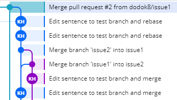
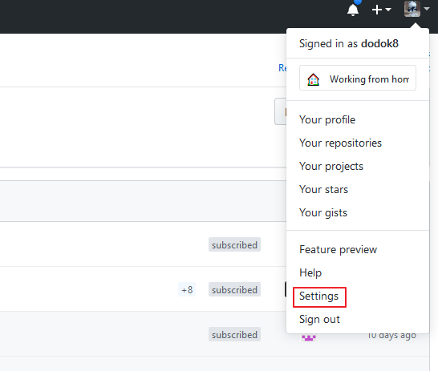

# Git과 Github

## Git이란?

여러분은 프로그램을 만들 때, 한 가지 기능만 만드는 경우도 드물고, 한 사람이서 작업하는 경우도 드뭅니다. 따라서 각자 작업한 것을 합치고, 만들었던 것들을 관리해야 하는데, 이를 어떻게 해야 할까요? 개발자들은 이를 위해 버전관리를 해주는 소프트웨어를 만들었습니다.(Version Control System) 이러한 버전 관리 소프트웨어 중에서 가장 자주 쓰이는 것은 SVN과 Git입니다.
저희가 사용할 것은 Git입니다. Git은 리눅스의 개발자로 유명한 리누스 토르발즈께서 만드셨습니다. 리눅스 커널을 관리하기 위해 처음에는 BitKeeper라는 서비스를 이용했는데,  이 회사와 마찰이 생기자 이를 대체하기 위해 만들었습니다. 그렇게 만들어진 Git은 현재 버전 관리 소프트웨어 중에 가장 넓게 사용되고 있습니다. Git은 메인 저장소를 복사한 개인 저장소에서 버전관리를 하고, 그걸 메인 저장소에 올리는 방식으로 작업이 이루어집니다.

### Git 시작하기
 git에서 소스코드가 저장되고 버전관리가 적용되는 공간을 저장소라고 합니다. 여러분의 컴퓨터에 저장된 저장소를 로컬 저장소라 하고, 인터넷이나 네트워크에 올라가 있는 저장소를 원격 저장소라 합니다. 일반적으로 우리가 작업물을 보관하는 원격저장소를 orgin이라 합니다.  여기가 우리가 작업하는 소스코드의 근원이자 결과물을 올리는 곳이죠. 이 원격저장소 관리 서비스를 제공하는 서비스도 Github, Gitlab등 다양한 곳이 있습니다. 저희는 Github를 주로 씁니다.

#### `git init`

현재 폴더 git 저장소로 만들어 줍니다. 주로 프로젝트 폴더를 만들고, 그 폴더로 이동해서 이 명령어를 실행합니다. 이 명령어를 실행하면 .git 이라는 숨김 설정이 되어 있는 폴더가 하나 생기는데 여기서 git이 관리를 해줍니다.

#### `git status`

 git이 파일을 관리할 때, 크게 2가지 종류가 있습니다. 하나는 변경 사항을 계속 추적하는 Tracked, 변경 사항 추적에서 제외하는 Untracked입니다. 이 명령어를 실행하면, Tracked 파일들의 변경사항을 알려줍니다. 일단 기본적으로 저장소 내 모든 파일은 Tracked입니다.

 그렇다면 어떻게 하면 파일은 Untracked로 만들 수 있을까요? `.gitignore` 파일을 만들면 됩니다. `.gitignore` 파일 안에 디렉토리나 파일의 상대경로를 적어주면 그걸 기준으로 자동으로 Untracked 상태가 됩니다. 특정 확장자를 제외하고 싶을 경우, 예를 들어 xs파일을 제외하고 싶으면 `*.xs`라 적으면 됩니다.

 이 gitignore는 직접 만들수도 있지만 많이 귀찮은데요. 요즘 사용되는 대부분의 개발환경 툴에는 `.gitignore`를 자동으로 만들어 주는 옵션이 들어있고, [gitignore.io](https://www.gitignore.io/) 같은 곳에서 여러분의 환경에 맞는 프리셋을 찾을 수도 있습니다.

 이 `git status`는 현재 저장소의 상태를 보여줍니다. Tracked 파일 중에서 무엇이 수정되었는지, 삭제되고 추가되었는지 여러 정보를 보여줍니다. 여러 옵션을 추가하여 더 자세한 정보를 볼 수 있습니다.

#### `git add`

 Tracked 파일은 또 다시 3가지 상태로 나눠집니다. 수정되지 않은 상태, Staged된 상태, Unstaged 된 상태입니다. 

 Stage는 뭐냐고요? 여러분이 버전 관리 시스템에 이 일을 했다라고 기록하기 전에, 기록할 파일을 고르는 일입니다.

 Git는 수정된 모든 파일을 자동으로 stage해주지 않습니다. 여러분이 기록을 하기 전에 골라서 stage를 해줘야 합니다. `add`는 그 때 사용하는 명령어입니다. `git add -p`를 하면 변경된 파일들 중에 골라서 stage를 할 수 있습니다.

#### `git commit`

 여러분이 stage해서 고른 파일들을 커밋이라는 단위로 묶어서 기록해줍니다. 이 때 기록되는 건 stage 시점의 파일입니다. 그 이후에 추가 수정사항이 있으면 커밋 전에 다시 stage를 해주고 커밋해주세요.

 커밋을 할 때, 기본적으로 이 커밋에서 무엇을 했는지 메세지를 남깁니다. 기본적으로 깃에서 만들어주기는 하지만, 정말 예외적인 상황(예) 브랜치 병합시 자동으로 생기는 커밋) 같은 게 아닌 이상 `git commit -m '메시지 내용'` 으로 커밋 메세지를 남겨주시길 바랍니다.

 어떻게 커밋 메세지를 작성해야할지 감이 안 오신다면 [이 글](https://meetup.toast.com/posts/106)을 읽어주세요.

#### `git remote`

 컴퓨터에 저장되어 있는 로컬 저장소와 네트워크(혹은 다른 위치에 있는) 저장소와 연결해 줍니다. 이 연결된 저장소가 원격 저장소가 됩니다.

 예를 들어, github에서 완전 빈 저장소를 만들었을 때(Initialize the repository with README.md에 체크를 하지 않으면 됩니다.),  다음과 같은 명령어를 치라고 하는데, 이 명령어는 주소에 나와있는 저장소를 origin이라는 이름으로 이 로컬 저장소의 원격저장소로 지정하겠다는 의미입니다.

```bash
git remote add origin git@github.com:dodok8/silver-bassoon.git
```

#### `git clone`

 원격 저장소를 다운 받아서, 로컬 저장소를 만듭니다. 이 경우 자동으로 원격저장소가 orgin이라는 이름으로 들어와 있습니다. 이 행위를 포크한다고 합니다. 굳이 원격 저장소를 복사해서 로컬저장소를 만드는 것 뿐만이 아니라, 다른 사람 소유의 원격저장소를 복사해서 자신 소유의 원격저장소를 만드는 행위도 포크라고 합니다.

```bash
git clone git@github.com:dodok8/silver-bassoon.git
```

#### `git push`

 커밋들을 원격 저장소에 올립니다. 만약 로컬 저장소와 원격저장소 사이에 충돌이 있을 경우(다른 사람의 커밋이 먼저 올라가 있는 경우) 다음 명령어, `git pull`을 먼저 실행해야 합니다.

#### `git pull`

 두 가지 명령을 동시에 실행합니다. 하나는 원격저장소에 올라와 있는 커밋들을 내려받는 `git fetch`입니다.

 그 다음에 시행 되는 명령은 `git merge` 입니다. merge는 여러 커밋이 겹칠 때, 새로운 커밋을 만들어서 거기서 내용을 정리합니다.

 `merge`가 아닌 `rebase`라는 방법을 선택할 수도 있습니다.(`git pull --rebase`) 머지는 새로운 커밋을 만들어서 정리하는데, rebase는 커밋들을 일렬로 순서를 정리해 줍니다.

 머지와 리베이스 둘 다 커밋을 정리하는 중에, 같은 내용을 다루는 커밋들이 있다면, 이 부분에서 충돌(conflict)가 발생합니다. 이 경우에는 충돌하는 부분을 수정해서 정리해줘야 합니다. 아래는 충돌이 발생하는 상황에서 git이 출력하는 메세지 입니다.

```bash
C:\Users\IMES\Desktop\fantastic-robot>git push
To github.com:dodok8/fantastic-robot.git
 ! [rejected]        master -> master (non-fast-forward)
error: failed to push some refs to 'git@github.com:dodok8/fantastic-robot.git'
hint: Updates were rejected because the tip of your current branch is behind
hint: its remote counterpart. Integrate the remote changes (e.g.
hint: 'git pull ...') before pushing again.
hint: See the 'Note about fast-forwards' in 'git push --help' for details.

C:\Users\IMES\Desktop\fantastic-robot>git pull --rebase
First, rewinding head to replay your work on top of it...
Applying: Add test2 to pull --rebase
Using index info to reconstruct a base tree...
M       README.md
Falling back to patching base and 3-way merge...
Auto-merging README.md
CONFLICT (content): Merge conflict in README.md
error: Failed to merge in the changes.
Patch failed at 0001 Add test2 to pull --rebase
Use 'git am --show-current-patch' to see the failed patch

Resolve all conflicts manually, mark them as resolved with
"git add/rm <conflicted_files>", then run "git rebase --continue".
You can instead skip this commit: run "git rebase --skip".
To abort and get back to the state before "git rebase", run "git rebase --abort".
```


### 잘못된 커밋 고치기

#### `git reset <옵션> <커밋번호>`

  커밋 번호 시점으로 돌아가고, 그 이후 커밋들을 삭제합니다. 기본 옵션은 `--mixed`로, 스테이지는 해제되지만, 커밋 번호 이후에 수정한 내용입니다. 스테이지 상태를 그대로 유지하고 싶으면 `--soft`로, 완전히 변화 내역마저 날리고 싶으면 `--hard`를 사용해주세요.

 만약 여러분이 리셋을 사용하기 전에 푸시한 내역이 있을 경우, 당연히 충돌이 발생합니다. `git push --force`로 강제로 덮어 씌울 수도 있지만, 여러분 혼자 작업하는 브랜치가 아닌 경우에는 리셋을 쓰지 말고 다음에 말할 revert를 사용하길 바랍니다.

#### `git revert <커밋번호>` 

 마찬가지로 커밋을 전으로 수정해주는 명령어 이지만, 커밋기록을 지우는 리셋과는 다르게 이전으로 되돌리는 커밋을 기록해서 과거로 되돌립니다.

### 브랜치 이해하기

 git에는 브랜치라는 개념이 있습니다. 3명이 동시에 한 저장소에서 작업을 하면, 간단한 푸쉬와 풀만해도 계속 충돌을 해결하면서 진행해야 합니다. 이를 해결하기 위해, 각자 브랜치라는 것을 만들어서 거기서만 작업을 한 다음에, 나중에 합치는 것이죠. 일종의 분업이라고 생각하면 됩니다.

#### `git branch`

 브랜치 목록을 보고, 만들게 해주는 명령어입니다.

#### `git checkout`

 현재 브랜치를 바꾸는(이를 체크아웃이라고 합니다.) 명령어입니다. `git checkout -b <브랜치명>`을 하면 새로운 브랜치를 만들면서 동시에 체크아웃을 진행합니다.

#### `git stash`

 브랜치를 바꾸려고 시도할 때(체크아웃), 커밋이 안 된 수정된 파일이 있을 경우에는 체크아웃을 진행할 수 없습니다. 그 때 사용하는 것이 stash입니다. 일종의 임시 저장 개념으로, 현재까지 수정된 내용을 묶어서 기록해줍니다. 이 상황에서는 체크아웃을 진행할 수 있습니다. 다시 원래 브랜치로 돌아와서 `git stash apply`로 다시 꺼내 쓸 수 있습니다.

### 작업내용 합치기

 이 내용은 앞에서 다룬 내용입니다. `git pull`을 할 때, `git fetch` 말고도 이 과정이 일어나기 때문이죠. 다른 점이면, 이번에는 브랜치 별로 일어난다는 것입니다. 여러분이 커맨드라인에 이 명령어를 쳐서 바로 합칠 수도 있지만, 아래 Github 단락에서 다루는 Pull & Request를 **꼭** 진행해 주셨으면 합니다.

 작업내용이 합해진 다음, 필요없는 브랜치는 삭제하면 됩니다.

#### `git merge`

  여러 브랜치에서 작업한 내용을 합치는 커밋을 만들어 줍니다. 리베이스에 비해 최종 그래프가 복잡해지나, 각 브랜치에서 작업한 내용을 더 직관적으로 볼 수 있고, 충돌이 더 적게 일어납니다. 개인적으로는 다른 브랜치 끼리 합칠 때는 머지를 추천합니다.

#### `git rebase`

 여러 브랜치에서 진행된 커밋을 한 브랜치에서 작업한 것처럼 순서를 조정해줍니다. 훨씬 깔끔하게 보이는 장점이 있으나, 각 브랜치에서 무엇을 했는지 파악하기 힘들어지는 단점이 있고, 충돌이 더 많이 일어납니다.



## Github란?

 git을 제대로 사용하기 위해서는 원격저장소를 네트워크 상에 올려놓는 것이 편합니다. 이를 위해 여러 서비스를 제공하는 업체가 많은데, 가장 대표적인 업체가 Github입니다. 단순한 git서버 제공 뿐만이 아니라, 이슈를 관리하는 트래커 기능, 협업 관리 기능, 배포 및 테스트 자동화 등 다양한 도구를 제공해줍니다.

### SSH Keygen

 대부분의 Git 서버는 SSH 공개키를 이용해서 사용자를 인증합니다. 아니면 여러분이 원격저장소에 접속할 때마다 인증을 해야 합니다. [이 방법](https://git-scm.com/book/ko/v2/Git-%EC%84%9C%EB%B2%84-SSH-%EA%B3%B5%EA%B0%9C%ED%82%A4-%EB%A7%8C%EB%93%A4%EA%B8%B0)을 참고해서 인증 키를 만든 다음, Github에 등록하면 됩니다.

 


#### Pull & Request

 여러분이 다른 브랜치나 포크한 저장소에서 작업한 내용을 원래 저장소에 병합하고 싶지만, 권한이 없을 때 만드는 신청입니다. github의 다른 기능과 연동해서 테스트 코드 작성 및 통과 여부, 충돌 여부 등을 손쉽게 파악할 수 있고, 병합과정에서 논의하고 최종결정권자가 정리할 수 있습니다.

#### Issue tracker

 버그나 의문점 등이 생겼을 때, 이를 작성하고 보고하는 게시판이라 생각하면 됩니다. 풀 리퀘스트와 마찬가지로 다른 기능과 연동해서 단순한 게시판 이상의 능력을 가질 수 있습니다.

#### Github Pages

 Github 저장소에서 바로 정적인 페이지를 만들 수 있게 해줍니다. 기본 옵션으로 jekyll을 사용해서 진행하도록 되어 있습니다.

#### Github Action

 일정 간격, 혹은 git과 관련된 특정행동(push, pull, pull request, issue 등)을 감지했을 때, 등록된 세팅에 따라 코드를 실행해 주는 기능입니다. 아래의 Secret과 연동해서 보안에 민감한 내용은 환경변수로 넘겨 줄 수도 있습니다. 한 가지 단점은 이 코드에서 직접적으로 DB에 접근하거나 새로운 파일을 만드는 작업같은 건 힘듭니다. 그렇지만 이메일 발송이나 테스트 자동화 정도는 훌룡하게 해줄 수 있습니다.

#### Github Secret

 보안상 민감한 내용을 암호화 해서 보관해주는 서비스입니다. 예를 들어 DB 관리자 계정같은 정보를 암호화해서 넘겨줄 수 있죠.

## Git을 편하게 써보자

사실 Git을 커맨드로만 사용하는 것은 많이 불편합니다. 여러가지 클라이언트가 많이 나와있죠. 제가 추천하는 건 [GitKraken](https://www.gitkraken.com/)입니다. Source Tree같은 다른 훌룡한 앱도 많지만, 제가 이걸 쓰거든요.